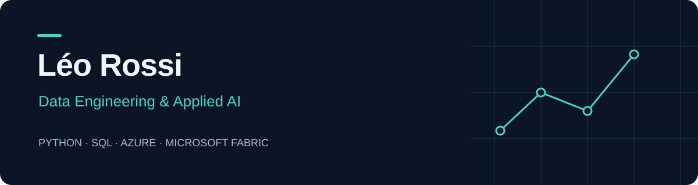

  <a href="https://www.linkedin.com/in/leo-rossi-data"><strong>LinkedIn</strong></a>
  &nbsp; · &nbsp; Paris, France
  &nbsp; · &nbsp; Français / English

## À propos

Je travaille sur la préparation, la fiabilisation et l'exploitation des données, avec un intérêt particulier pour les applications concrètes de l'intelligence artificielle.

Mon alternance chez **L-Acoustics (2024–2025)** m'a permis de relier développement Python, pipelines Microsoft Fabric et besoins des équipes métier. Je recherche un **CDI en data / IA à Paris, en Île-de-France ou en télétravail intégral**.

## Expérience appliquée

| Domaine | Travail réalisé chez L-Acoustics |
| :--- | :--- |
| **Analyse & anomalies** | Conception d'un dispositif de détection d'anomalies sur les promotions commerciales : préparation des données, exploration et restitution aux équipes Sales et à la Direction. |
| **Services IA** | Développement Python pour un service interne de traduction avec Azure et SharePoint : traitement des documents et optimisation des appels API. |
| **Évaluation d'outils** | Benchmark de solutions d'IA générative vidéo selon leur qualité, leur coût, leur faisabilité et leurs risques. |

*Ces expériences décrivent mon travail en entreprise. Les données et le code internes ne sont pas publiés ici.*

## Compétences

| | Technologies et pratiques |
| :--- | :--- |
| **Programmation & données** | Python · SQL · pandas · NumPy |
| **Cloud & pipelines** | Microsoft Fabric · Azure · Lakehouse · préparation et qualité des données |
| **Analyse & machine learning** | scikit-learn · statistiques · analyse exploratoire · détection d'anomalies |
| **Visualisation & collaboration** | Power BI · Git / GitHub · documentation et restitution métier |

## Portfolio en construction

Je reconstruis ce portfolio autour de projets personnels reproductibles, avec données publiques ou synthétiques, tests et documentation.

**Premier projet prévu — Analyse des ventes et détection d'anomalies**

Ingestion Python, transformations SQL, contrôles de qualité et tableau de bord, puis comparaison de méthodes de détection d'anomalies. Le dépôt et les résultats seront ajoutés une fois la première version disponible.

---

  <strong>Des données fiables. Des choix expliqués. Des résultats vérifiables.</strong>

